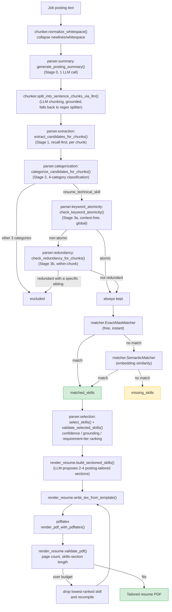

# resumeopt

A resume tailoring pipeline that reads a job posting, extracts genuine technical skills from it using a reasoning LLM, matches those skills against a canonical, human-curated skills cache, and renders a tight, ATS-friendly LaTeX skills section as a one-page PDF resume.

The current scope is **skills-section only** — it does not yet tailor experience bullets or projects.

Design docs: [`docs/agent/SPEC.md`](docs/agent/SPEC.md) (product spec), [`docs/agent/DEV_PLAN.md`](docs/agent/DEV_PLAN.md) (backend implementation plan/history), [`docs/agent/FRONTEND_DEV_PLAN.md`](docs/agent/FRONTEND_DEV_PLAN.md) (web UI plan/phase history).

## Prerequisites

- Python 3.11+ (developed against 3.13)
- `pip install -r requirements.txt`
- A LaTeX distribution providing `pdflatex` on `PATH` (e.g. `brew install --cask mactex-no-gui` on macOS, `apt install texlive-latex-base texlive-latex-extra` on Debian/Ubuntu) — required for the render/compile step; the pipeline shells out to it directly.
- An API key for whichever LLM provider you use (`OPENAI_API_KEY`, `ANTHROPIC_API_KEY`, or a local Ollama install) — see [Example usage](#example-usage) below.
- Node.js + npm — only needed for the optional [Web UI](#web-ui) frontend.

## How it works, at a glance

1. **Summarize** the posting once (Stage 0) — role title, seniority, industry domain, core/nice-to-have requirements — as shared background context for every later extraction call.
2. **Chunk** the posting into sentence/bullet-level passages. An LLM-based chunker (the default) splits headers and bullets accurately even without terminal punctuation, verifying every chunk is an exact, grounded substring of the posting; falls back to a deterministic regex sentence-splitter if the LLM call fails or returns nothing grounded.
3. **Extract** (Stage 1) candidate skill terms from each chunk independently, deliberately recall-first — over-inclusion here is expected and corrected in later stages.
4. **Categorize** (Stage 2) each candidate into one of four categories — `resume_technical_skill`, `degree_or_qualification`, `soft_skill`, `non_skill` — using the chunk as local context. Only `resume_technical_skill` survives.
5. **Filter redundancy** (Stage 3) among Stage 2 survivors in two steps:
   - **3a — keyword-atomicity gate**: a context-free, global check — does this term have independent, standalone resume/ATS-keyword value on its own merits? Atomic terms (e.g. `Machine Learning`, `Kubernetes`) bypass the next step entirely and are always kept.
   - **3b — within-chunk redundancy**: only for non-atomic terms — is a more specific sibling term also present in the same chunk (e.g. `version control` alongside `git`)? If so, the general restatement is dropped.
6. **Match** surviving candidates against the skills cache (`data/skills.yaml`) through a tiered matcher: exact/alias lookup first (free, instant), then embedding-based semantic similarity for phrasing variants the cache doesn't literally contain.
7. **Select and validate** the strongest match per canonical skill, enforcing confidence and grounding, then rank by relevance — an explicit core-requirement/nice-to-have match (reusing Stage 0's posting summary, no extra LLM call) outranks confidence/match-type alone.
8. **Group** the ranked skills into 2-4 posting-tailored resume sections (an LLM proposes concise section names specific to the role/domain — e.g. `Security` / `Cloud & DevOps` — rather than a fixed, generic set), then **render, compile, and fit to budget**: inject into the LaTeX template, compile to PDF with `pdflatex`, and validate the result (page count, skills-section line count, default max 4 lines). If the skills section is too long, drop the single lowest-ranked skill and recompile — repeating until it fits or only one skill remains — rather than estimating a character budget up front (LaTeX line-wrapping is too fragile to predict analytically; the actual compile is the only reliable signal).

Every run writes its intermediate artifacts (chunks, per-stage verdicts and reasoning, matched/missing skills, validation reports, PDF validation) to `build/<run_name>/logs/`, so any run can be fully audited after the fact.

## Architecture



Stage 1 is validated to run at 100% recall (deliberately over-inclusive); Stage 2's 4-category classification then lifts precision without costing recall; Stage 3's atomicity-then-redundancy split fixes a specific over-aggression bug in an earlier single-question redundancy design (foundational terms like `Machine Learning` being wrongly dropped as "redundant" with their own sub-techniques) while preserving 100% recall on this project's benchmark fixture. See repo memory (`/memories/repo/parsing.md`) for the full validated numbers and architecture history.

### Package layout

| Package | Responsibility |
|---|---|
| `src/chunker/` | Text normalization (`normalize_whitespace`), sentence/bullet-level chunking — LLM-based (`split_into_sentence_chunks_via_llm`, default) and deterministic regex fallback (`split_into_sentence_chunks`) — and grounded quote lookup (`locate_quote`) |
| `src/parser/` | The full extraction pipeline: Stage 0 posting summary, Stage 1 extraction, Stage 2 categorization, Stage 3a/3b atomicity+redundancy, orchestration (`pipeline.py`), the top-level `parse_posting()` entry point (`factory.py`), the deterministic cache-only fallback strategy (`base.py`), and final skill selection/validation (`selection.py`) |
| `src/matcher/` | Tiered skill-cache matching: exact/alias lookup, embedding-based semantic matching, LLM grounding confirmation |
| `src/llm/` | Provider abstraction (OpenAI, Anthropic, Ollama) with structured JSON outputs, embeddings, and shared async batching/retry plumbing (`batch_calls.py`) used by both `chunker` and `parser` |
| `src/render_resume.py` | LLM-based section grouping, LaTeX template injection, `pdflatex` invocation, PDF validation, and canonical skill-name capitalization (`capitalize_skill_name`) |
| `src/main.py` | CLI entry point wiring the whole pipeline together |
| `src/webapp/` | FastAPI backend (`app.py`) exposing the pipeline over HTTP for the web UI - run triggering/polling, skills-cache CRUD, template read/write |

## Web UI

A local web UI (FastAPI backend + React/TypeScript frontend) wraps the CLI pipeline for interactive use - paste a posting, watch a real per-stage/per-batch progress bar, inspect selected/missing skills with evidence, download the PDF, and manage the skills cache (add/remove entries, edit aliases inline, toggle "always include" skills, promote missing skills found in a run) - all without touching the CLI.

Start the backend (binds to `127.0.0.1` only - this app can trigger billed LLM calls per request, so it's not exposed beyond localhost by default):

```bash
PYTHONPATH=src python3 -m uvicorn webapp.app:app --host 127.0.0.1 --port 8000
```

Start the frontend dev server (proxies `/api` to the backend above, so no CORS setup is needed in normal dev use):

```bash
cd frontend
npm install
npm run dev
```

Then open the printed Vite URL (typically `http://localhost:5173`). See `docs/agent/FRONTEND_DEV_PLAN.md` for the full design/phase history.

### API reference

All routes are under `http://127.0.0.1:8000`. The backend triggers real (billable) LLM calls on `POST /api/runs`, so it isn't exposed beyond localhost by default.

| Method | Path | Description |
|---|---|---|
| `GET` | `/api/skills` | List every skill in the cache (`name`, `aliases`, `always_include`). |
| `POST` | `/api/skills` | Add a new skill (`name`, `aliases`). Name is capitalized via `capitalize_skill_name` before storing. |
| `PATCH` | `/api/skills/{name}` | Partially update a skill — `aliases` and/or `always_include`, only the fields provided are changed. |
| `DELETE` | `/api/skills/{name}` | Remove a skill from the cache (a timestamped backup of the previous cache file is kept first). |
| `GET` | `/api/template` | Fetch the raw LaTeX template (`data/template.tex`) as plain text. |
| `POST` | `/api/template` | Save the LaTeX template (`content`); validates the skills-placeholder marker is still present. |
| `POST` | `/api/runs` | Start a tailoring run in the background (`posting_text` + optional provider/model/concurrency overrides — mirrors the CLI flags below). Returns `{run_id, status}` immediately. |
| `GET` | `/api/runs` | List all runs known to this backend process (in-memory only — cleared on restart; `build/<run_id>/` folders on disk are unaffected). |
| `GET` | `/api/runs/{run_id}` | Poll one run's status. While `running`, also includes `current_stage`/`stage_index`/`stage_total` and, during `parse_posting`, `substage`/`substage_completed`/`substage_total`. Once `completed`, includes the full `run_metrics.json` under `metrics`. |
| `GET` | `/api/runs/{run_id}/pdf` | Download the tailored resume PDF for a completed run. |
| `GET` | `/api/runs/{run_id}/logs/{log_name}` | Fetch one of the run's JSON log artifacts (allow-listed filenames only, e.g. `validation_report.json`, `missing_skills.json`, `run_metrics.json`). |
| `POST` | `/api/runs/{run_id}/missing-skills/{term}/promote` | Promote a term from that run's `missing_skills` list into the canonical skills cache. |

## Example usage

Set an API key (`.env` file or environment variable) for whichever provider you use:

```bash
export OPENAI_API_KEY=sk-...
```

Run the pipeline against a plain-text job posting (run from the repo root; `PYTHONPATH=src` is required since the codebase's internal imports assume `src/` itself is on the Python path):

```bash
PYTHONPATH=src python3 src/main.py path/to/job_posting.txt --provider openai --run-name my_run
```

This produces:

```
build/my_run/
├── tailored_resume.pdf        # the final one-page resume
├── aux/                       # LaTeX source and pdflatex build artifacts
└── logs/
    ├── parsed_records.json        # matched/missing skills + full per-term stage verdicts (extraction_debug_samples)
    ├── extraction_debug.json      # chunks + per-term extraction/category/atomicity/redundancy reasoning
    ├── validation_report.json     # selected skills + confidence/grounding checks
    ├── sectioned_skills.json      # final dynamic 2-4 section grouping (LLM-proposed, posting-tailored names)
    ├── pdf_validation.json        # page count + skills-section length checks (final, post-trim state)
    └── run_metrics.json           # stage timings, LLM token usage, and trim_iterations (skills dropped to fit the page)
```

Useful flags:

```bash
# Use a different skills cache or template
PYTHONPATH=src python3 src/main.py posting.txt --skills-cache data/skills.yaml --template data/template.tex

# Use a different judge-tier model (Stage 0 summary, skill-section grouping, validation grounding fallback)
PYTHONPATH=src python3 src/main.py posting.txt --provider openai --model gpt-4o

# Use a different reasoning-tier model (chunking, extraction, categorization, Stage 3 atomicity/redundancy)
PYTHONPATH=src python3 src/main.py posting.txt --reasoning-model gpt-5-mini

# Use a different (cheaper, non-reasoning) chunk-screening model (Stage 0.5 pre-filter)
PYTHONPATH=src python3 src/main.py posting.txt --screening-model gpt-4o-mini

# Tune how many reasoning-model calls run concurrently
PYTHONPATH=src python3 src/main.py posting.txt --max-concurrency 24

# Name the output run folder under build/ (defaults to a timestamp)
PYTHONPATH=src python3 src/main.py posting.txt --run-name my_run

# Deterministic-only parsing, no LLM calls at all
PYTHONPATH=src python3 src/main.py posting.txt --no-llm-parser
```

## The skills cache (`data/skills.yaml`)

Skills are matched against a small, curated cache, not invented freely:

```yaml
- name: Python
  aliases:
  - py
- name: Git
  aliases:
  - git-based development
- name: C#
  aliases:
  - csharp
  - c sharp
- name: Object-Oriented Programming
  aliases:
  - oop
  always_include: true
```

- `name` is the canonical skill shown on the resume. Store it already capitalized the way it should render (`capitalize_skill_name` is applied both when a skill is added via the web UI and at render time, so acronym-style names like `SQL`/`PostgreSQL` and multi-word names like `Data Visualization` render correctly instead of being naively re-capitalized per word).
- `aliases` are exact-match variants (case/whitespace-insensitive). Omitted (not written) when empty.
- `always_include: true` marks a skill to include on every tailored resume regardless of whether the posting mentions it (e.g. a language or practice you always want listed). Omitted (not written) when `false`, the default.
- Anything extracted from a posting that isn't in the cache shows up in `missing_skills` for review, rather than being silently invented or silently dropped.

## Running tests

Backend (Python):

```bash
PYTHONPATH=src python -m unittest discover -s tests -t . -p 'test_*.py'
```

`-t .` (explicit top-level directory) matters here — without it, `tests/llm/`, `tests/main/`, and `tests/matcher/` collide with the top-level `src/llm`, `src/main.py`, and `src/matcher/` packages during test discovery.

Most tests are deterministic (stubbed LLM providers) and require no API key. A few standalone benchmark scripts under `tests/parser/`/`tests/chunker/` (not gated unittests, run via `python -m`) call a live LLM provider to validate model quality against curated fixtures — see repo memory for the latest validated precision/recall/F1 numbers per stage.

Frontend (TypeScript, pure-logic tests via `vitest` - no browser or backend required):

```bash
cd frontend
npm run test
```
