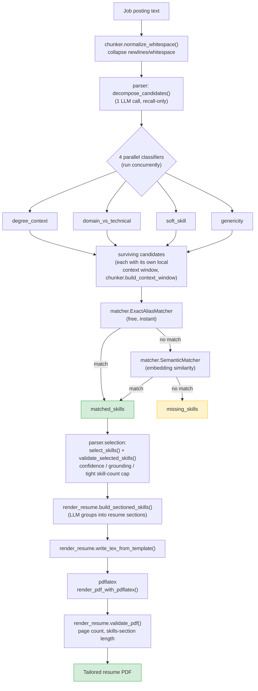

# resumeopt

A resume tailoring pipeline that reads a job posting, extracts genuine technical skills from it using an LLM, matches those skills against a canonical, human-curated skills cache, and renders a tight, ATS-friendly LaTeX skills section as a one-page PDF resume.

The current scope is **skills-section only** — it does not yet tailor experience bullets or projects.

## How it works, at a glance

1. **Normalize** the raw posting text (strip out unreliable line-break/whitespace artifacts from pasted/PDF-derived text).
2. **Decompose** the posting into atomic candidate skill mentions (one LLM call, recall-only — no judgment yet).
3. **Classify** each candidate through four independent, narrowly-scoped LLM classifiers run in parallel, each checking one thing: is this merely a listed degree/qualification? A business domain label vs. a real technical field? A soft skill? A vague, unnamed category placeholder? A candidate is excluded if *any* classifier flags it.
4. **Match** surviving candidates against the skills cache (`data/skills.yaml`) through a tiered matcher: exact/alias lookup first (free, instant), then embedding-based semantic similarity for phrasing variants the cache doesn't literally contain.
5. **Select and validate** the strongest match per canonical skill, enforcing confidence, grounding, and a tight skill-count cap (truncating gracefully rather than failing when a posting has more genuine skills than fit in a compact section).
6. **Render** the selected skills into LaTeX-grouped sections (e.g. Languages / Tools / ML & Data), inject them into a template, compile to PDF with `pdflatex`, and validate the resulting PDF (page count, skills-section line count).

Every run writes its intermediate artifacts (parsed candidates, per-classifier reasoning, matched/missing skills, validation reports, PDF validation) to `build/<run_name>/logs/`, so any run can be fully audited after the fact.

## Architecture



Steps 3-4 (decomposition + classification) run with self-consistency voting: the whole extraction pass is repeated `--num-votes` times and only candidates a majority of samples agree on survive. Every LLM call is I/O-bound, so votes run concurrently rather than adding latency, as long as `--max-workers` is sized to hold them all in flight.

### Package layout

| Package | Responsibility |
|---|---|
| `src/chunker/` | Text normalization and per-candidate local context windows (replaces line/sentence-based chunking) |
| `src/parser/` | Decomposition, parallel classifiers, self-consistency voting, final skill selection/validation |
| `src/matcher/` | Tiered skill-cache matching: exact/alias lookup, embedding-based semantic matching, LLM grounding confirmation |
| `src/llm/` | Provider abstraction (OpenAI, Anthropic, Ollama) with structured JSON outputs and embeddings |
| `src/render_resume.py` | LLM-based section grouping, LaTeX template injection, `pdflatex` invocation, PDF validation |
| `src/main.py` | CLI entry point wiring the whole pipeline together |

## Example usage

Set an API key (`.env` file or environment variable) for whichever provider you use:

```bash
export OPENAI_API_KEY=sk-...
```

Run the pipeline against a plain-text job posting:

```bash
python src/main.py path/to/job_posting.txt --provider openai --run-name my_run
```

This produces:

```
build/my_run/
├── tailored_resume.pdf        # the final one-page resume
├── aux/                       # LaTeX source and pdflatex build artifacts
└── logs/
    ├── parsed_records.json        # extracted candidates + matched/missing skills
    ├── extraction_debug.json      # per-candidate, per-classifier reasoning
    ├── validation_report.json     # selected skills + confidence/grounding checks
    ├── sectioned_skills.json      # final Languages/Tools/etc. grouping
    ├── pdf_validation.json        # page count + skills-section length checks
    └── run_metrics.json           # stage timings and LLM token usage
```

Useful flags:

```bash
# Use a different skills cache or template
python src/main.py posting.txt --skills-cache data/skills.yaml --template data/template.tex

# Use a different provider/model
python src/main.py posting.txt --provider anthropic --model claude-3-5-sonnet-20241022

# Tune self-consistency voting and concurrency
python src/main.py posting.txt --num-votes 3 --max-workers 24

# Deterministic-only parsing, no LLM calls at all
python src/main.py posting.txt --no-llm-parser
```

## The skills cache (`data/skills.yaml`)

Skills are matched against a small, curated cache, not invented freely:

```yaml
- name: python
  aliases:
    - py
- name: git
  aliases:
    - git-based development
  related:
    - version control
- name: c#
  aliases:
    - csharp
    - c sharp
```

- `name` is the canonical skill shown on the resume.
- `aliases` are exact-match variants (case/whitespace-insensitive).
- `related` terms contribute to matching but at lower confidence than an exact alias.
- Anything extracted from a posting that isn't in the cache shows up in `missing_skills` for review, rather than being silently invented or silently dropped.

## Running tests

```bash
python -m unittest discover -s tests -t . -p 'test_*.py'
```

`-t .` (explicit top-level directory) matters here — without it, `tests/llm/`, `tests/main/`, and `tests/matcher/` collide with the top-level `src/llm`, `src/main.py`, and `src/matcher/` packages during test discovery.

Most tests are deterministic and require no API key. A few (parser/matcher benchmarks against real postings) call a live LLM provider and are skipped automatically if the corresponding API key isn't set.
