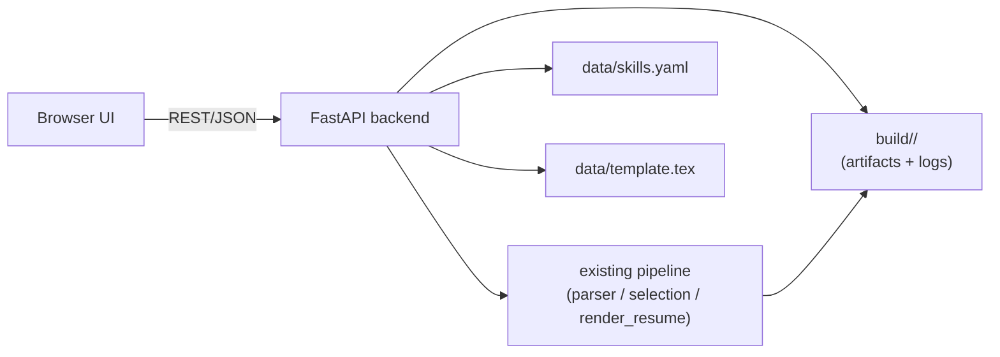

# Resume Tailoring Frontend - Development Plan

## Handoff Rule
Any agent taking over this plan should read `AGENTS.md` and `docs/agent/SPEC.md`/`docs/agent/DEV_PLAN.md` first - this plan adds a UI on top of the existing pipeline, it does not change the pipeline itself.

## Goal
Add a lightweight local web UI on top of the existing CLI/pipeline (`src/main.py`) so a user can manage inputs (template, skills cache, job posting) and trigger/inspect runs without touching a terminal or hand-editing YAML.

## Relationship to the Existing Backend
- Reuses the pipeline (`parser.parse_posting`, `selection.validate_selected_skills`, `render_resume.*`) exactly as-is - nothing here changes parsing/matching/rendering behavior.
- The one required backend change is refactoring `src/main.py`'s pipeline orchestration into an importable function (`posting_text, config -> result`) callable from a web server process, not only reachable via `argparse`. The existing CLI becomes a thin wrapper around that same function - a pure refactor, no behavior change.
- Every existing human-review gate from `AGENTS.md` still applies through the UI - e.g. promoting a missing skill into the cache is still an explicit, reviewable action, never an automatic write.

## Requested Features
1. Upload a resume LaTeX template (replace/manage `data/template.tex`).
2. View and edit the skills cache (add/remove entries) easily.
3. Paste a job posting directly as text (no URL fetch/scraping - explicitly out of scope for now, flagged as a possible future consideration).
4. One-click "add to cache" for missing skills surfaced by a run.

## Suggested Additional Features
- **Run dashboard/history**: browse past `build/<run_name>/` runs, see status at a glance, download PDF/tex, reopen logs without digging through the filesystem.
- **In-browser PDF preview**: render the tailored resume inline, not just as a download link.
- **Skill provenance/evidence viewer**: click a selected skill and see the extraction reasoning + posting sentence that grounded it (this data is already logged in `extraction_debug.json`/`parsed_records.json` - purely a presentation layer, no new pipeline work).
- **Cache editor safety net**: duplicate-name validation before save (reusing `DeterministicPostingParser`'s existing loader/validator), a diff preview before committing an edit, and a versioned backup of `skills.yaml` before every write.
- **Missing-skills review queue**: a structured view of `missing_skills`/`discarded_terms` with "promote to cache" (opens a pre-filled, editable add-skill form) vs. "dismiss" actions, replacing manual JSON inspection.
- **Config/model picker**: expose provider, reasoning model, screening model, and max-concurrency as form controls instead of CLI-only flags.
- **Async run trigger with live status**: a run takes roughly 1-2 minutes end to end, so trigger it as a background job and poll/stream status (parse -> validate -> group -> render -> PDF-validate) rather than blocking the page.
- **Cost/usage view**: visualize `run_metrics.json`'s `llm_usage`/token counts per run, plus a simple running total across runs.
- **Trim-loop visibility**: surface which skills the fit-to-budget loop dropped and why (`trim_iterations`, before/after skill list) instead of only the final result.
- **Run comparison view**: side-by-side diff of two runs' selected skills (e.g. before/after a cache edit).
- **Cache search/filter/sort**: by canonical name or alias, useful once the cache grows past a couple dozen entries.
- **Template editor with preview-compile**: syntax-highlighted (or plain, to start) textarea with a "compile and preview" step before saving as the default template.
- **Local-only binding by default**: this tool holds LLM provider API keys and triggers billed calls per click - bind to `127.0.0.1` only, and treat any remote/network exposure as a deliberate, separate decision that needs auth added first.

## Standard QOL Features
- Autosave the posting-text draft (e.g. `localStorage`) so a browser refresh doesn't lose an in-progress paste.
- Clear loading/error states for every async action (run trigger, cache save, PDF render).
- Confirmation prompts on destructive actions (delete a skill, overwrite the template).
- Keyboard shortcut to submit/run (Cmd/Ctrl+Enter).
- Client-side validation before hitting the backend (non-empty posting text, template still contains the `[INSERT SKILLS HERE]` placeholder, etc.).
- Dark/light theme toggle (low priority, common expectation).
- Reasonable responsive layout (secondary priority for a personal tool, but shouldn't break on a laptop-sized window).

## Proposed Architecture

### Backend
- Wrap the existing pipeline behind a small **FastAPI** service - async support fits the "trigger a long job, poll status" pattern, and Pydantic models pair naturally with this project's existing JSON-schema-heavy design. No heavier framework is needed for a personal tool.
- Refactor `src/main.py`'s orchestration into a plain callable (`run_pipeline(posting_text, config) -> result`); the CLI keeps working as a thin wrapper around the same function.
- Indicative endpoints:
  - `GET/POST/DELETE /api/skills` - list/add/update/delete cache entries, going through the existing cache loader/validator so duplicate-name and shape validation is reused, not reimplemented.
  - `GET/POST /api/template` - fetch/replace `data/template.tex`.
  - `POST /api/runs` - kick off a pipeline run (posting text + config overrides), returns a run id.
  - `GET /api/runs/{id}` - status + metrics + artifact links once complete.
  - `GET /api/runs/{id}/pdf` - stream the rendered PDF.
  - `GET /api/runs/{id}/logs/{name}` - fetch a specific log JSON for the debug views.
  - `POST /api/runs/{id}/missing-skills/{term}/promote` - promote one missing-skill candidate into the cache through the same validated write path as the manual editor.
- Background execution: run the pipeline in a background task/thread (FastAPI `BackgroundTasks` or a simple in-process queue), persisting status keyed by run id since a run takes noticeable wall-clock time.

### Frontend
Two viable options - pick one explicitly before scaffolding starts:
- **Option A - React + TypeScript + Vite**: standard SPA, best fit if the UI grows complex (live-updating run status, editable tables, richer previews) - more setup, scales better.
- **Option B - FastAPI + Jinja2 + HTMX**: far less new tooling, keeps almost everything in Python, server-rendered partial updates - a good fit for "get a usable UI fast" over a polished product.
- **Recommendation**: start with Option B for the MVP scope; revisit React only if the UI's interactivity needs clearly outgrow HTMX (e.g. rich in-browser annotation, drag-and-drop reordering).
- PDF preview via a plain `<iframe>`/`<embed>` pointed at `/api/runs/{id}/pdf` - browsers render PDFs natively, no extra library needed for a basic preview.

## Data & Security Notes
- All `data/skills.yaml` writes go through the same load/validate path `DeterministicPostingParser` already uses (duplicate-name rejection, shape validation) - never write raw form input directly to the file.
- Keep a rolling backup of `data/skills.yaml` before every UI-driven write (e.g. a small history under `build/cache_history/`), so a bad edit is recoverable.
- Default to binding `127.0.0.1` only; do not add remote/network exposure without deliberately adding authentication first, since this app can trigger billed LLM calls per click.
- Validate an uploaded template still contains the `[INSERT SKILLS HERE]` placeholder before accepting it, mirroring `inject_skills_into_template`'s existing marker check.

## Phased Plan

### Phase 1 - Backend API scaffold (no new UI yet)
- [x] Refactor `src/main.py`'s pipeline entry point into an importable, argv-independent function - turned out to already be in this shape (`run_pipeline(config: PipelineConfig) -> None`, no argv dependency); the CLI's `main()`/`build_parser()` remain thin wrappers around it, unchanged.
- [x] Stand up the FastAPI app skeleton with the endpoints above (skills CRUD, template CRUD, run trigger/status/artifact retrieval) - implemented in `src/webapp/` (`app.py`, `run_manager.py`, `skills_cache_io.py`, `template_io.py`). Live-smoke-tested via `uvicorn` against the real `data/skills.yaml`/`data/template.tex`.
- [x] Add backend tests (deterministic, no live LLM calls) for the new endpoints, mirroring existing `tests/` conventions - `tests/webapp/test_app.py` (16 tests, uses a fake pipeline runner instead of a real one). Full suite: 122 tests, all green.

### Phase 2 - MVP UI (the 4 requested features)
- [x] Skills cache table view + add/remove form, backed by `/api/skills`.
- [x] Template upload/replace view, backed by `/api/template`.
- [x] Job posting paste box + run trigger + run status polling.
- [x] Missing-skills review list with a "promote to cache" action per term.

Implemented as a React + TypeScript + Vite SPA under `frontend/` (stack decision: React, per explicit user instruction, superseding the plan's earlier HTMX recommendation). `frontend/vite.config.ts` proxies `/api` to the FastAPI backend (`http://127.0.0.1:8000`) during dev, so the browser only ever talks to one origin; a narrow CORS allow-list (`localhost:5173`/`127.0.0.1:5173` only, not a wildcard) was also added to `src/webapp/app.py` as a safety net for running the dev server without the proxy. Live-smoke-tested full stack (`uvicorn` + `vite dev`) via a real browser session against the actual `data/skills.yaml`/`data/template.tex` - both pages render correctly. Production build (`npm run build`) succeeds.

### Phase 3 - Run inspection & QOL
- [x] Run history/dashboard listing past runs - new "History" tab (`RunHistoryPage.tsx`), backed by `GET /api/runs`; in-memory only (cleared on backend restart - `build/<run_id>/` folders themselves persist on disk regardless).
- [x] In-browser PDF preview - was already implemented in Phase 2's `RunPage`, carried over into the shared `RunDetail` component so it also works for historical runs selected from the History tab.
- [x] Skill provenance/evidence viewer - `RunDetail` fetches `validation_report.json` and renders a table of selected skills (canonical name, match type, confidence, evidence sentence) rather than only a raw metrics dump.
- [x] Cost/usage view per run - `RunDetail`'s `UsageSummary` renders `llm_usage.by_role` (model, call count, tokens per role) as a table; raw `run_metrics.json` is still available in a collapsible "Advanced" section.
- [x] Autosave draft posting text, loading/error states, confirmation prompts - autosave and error banners were already in place from Phase 2; delete-skill already had a confirm dialog.
- [x] Rudimentary progress bar (explicit user request, not originally itemized) - a `ProgressBar` component (indeterminate/animated, not a fake percentage) shown while a run's status is `"running"` in `RunDetail`. Deliberately indeterminate since the backend doesn't currently report a per-stage progress signal mid-run (only a final status + full metrics after completion) - a real percentage would need `main.run_pipeline` to expose incremental stage updates, out of scope for "rudimentary".

Refactored `RunPage` (the "Tailor resume" tab) down to just the posting textarea + trigger button; all status/results rendering (status badge, progress bar, PDF, skill table, usage table, missing-skills promote list) now lives in a shared `RunDetail` component reused by both the "Tailor resume" and "History" tabs. Live-validated against a real user-triggered run (not a fake/test run) - `RunDetail` correctly showed LLM usage by role, 4 selected skills with evidence, and 4 missing-skill candidates with working promote buttons.

### Phase 4 - Nice-to-haves (defer until the core is stable)
- [x] Config/model picker in the UI - `RunPage`'s "Advanced options" collapsible section (provider, judge model, reasoning model, screening model, max concurrency, use-LLM-parser toggle), passed through to `POST /api/runs` via a new `RunOptions` type in `api.ts` (all optional - backend defaults apply when omitted).
- [x] Cache search/filter/sort - `SkillsPage` gained a search box (matches name or any alias substring, case-insensitive) and a sort dropdown (name A-Z/Z-A, most-aliases-first), both client-side over the already-loaded skill list.

Live-validated: config picker renders with correct defaults and all fields editable; search correctly filters to a single row by both canonical name (`sql`) and by alias substring (`rdbms` -> `relational databases`); sort defaults to name A-Z. `tsc`/`vite build` clean, backend suite unaffected (122 tests, still green - frontend-only changes).

### Phase 5 - UI/UX polish audit
Compiled from a targeted audit of the current `frontend/` (user-reported issues + additional gaps found while inspecting the code).

**Layout stability**
- [x] **Root cause of the reported "text isn't justified"/"nav bar isn't consistently aligned" issues**: `.app { max-width: 960px; margin: 0 auto }` centers within the *visible* viewport width, which shrinks by the scrollbar's width (~15-17px) whenever the current tab's content is tall enough to need vertical scrolling (e.g. `Skills cache`'s full table) versus a short tab that doesn't (e.g. `Tailor resume` before a run exists). Fixed via `scrollbar-gutter: stable` + `overflow-y: scroll` on `html`. Verified live: the `.app-header`'s bounding-box `x` position is now pixel-identical (`x: 24`) between the tall `Skills cache` tab and the short `Tailor resume` tab.
- [x] **Second, more significant root cause found during implementation**: a leftover, never-cleaned-up default Vite `src/index.css` (from the original scaffold) was still imported by `main.tsx` and defined its own conflicting `:root` variables, its own separate `@media (prefers-color-scheme: dark)` override, and a global `#root { text-align: center }` rule - the last of which was centering paragraph/heading text throughout the app regardless of `App.css`'s intended left-aligned form-style layout, and the dark-mode override fought with the new theme toggle. Deleted `index.css` entirely and removed its import; all styling now lives solely in `App.css`.

**Other gaps found during the audit**
- [x] Browser tab title updated to `"resumeopt"` (`index.html`).
- [x] Favicon replaced with a small custom resumeopt-specific icon (document + checkmark), removing the default Vite lightning-bolt logo.
- [x] Success feedback added for add-skill/delete-skill actions (auto-dismissing `.banner.success`, matching the Template page's existing pattern).
- [x] Unsaved-changes protection on the Template page: a `beforeunload` guard warns on an actual browser close/refresh while dirty. The underlying "switching tabs silently discards edits" problem was fixed more robustly at the architecture level instead - `App.tsx` now keeps all 4 tab components permanently mounted (hidden via CSS `display: none` rather than conditionally rendered/unmounted), so in-progress state (draft template edits, skills search/sort, etc.) simply persists when navigating between tabs.
- [x] Cmd/Ctrl+Enter keyboard shortcut added to submit a run from the posting textarea.
- [x] Dark/light theme toggle added (`App.tsx` header button, CSS custom properties in `App.css` for both palettes, initial preference from `prefers-color-scheme` with an explicit override persisted to `localStorage`).
- [x] Responsive layout adjustments added (`@media (max-width: 640px)`: stacked header, wrapped nav, single-column config grid, smaller table text, shorter PDF preview) plus a `.table-wrapper` (`overflow-x: auto`) around every data table so wide tables scroll horizontally instead of breaking the layout on narrow viewports.
- [x] Replaced the native `window.confirm()` for skill deletion with a custom, theme-aware `ConfirmDialog` component.
- [x] `RunHistoryPage`: selecting "View" now scrolls the resulting `RunDetail` into view (`scrollIntoView({ behavior: 'smooth' })`).
- [x] Nav buttons now use `aria-current="page"` for the active tab (also now the sole styling hook, replacing the old separate `.active` class).
- [x] Added a reusable `Spinner` component (small animated ring + label) replacing plain "Loading…" text across `SkillsPage`, `TemplatePage`, `RunHistoryPage`, and `RunDetail`.

Live-validated in a real browser session (light and dark mode both checked): header position is now pixel-stable across tabs, dark mode renders correctly with legible contrast throughout (the `index.css` conflict is what had been washing out heading text), the confirm dialog matches the app's styling, and theme preference persists across a full page reload. `tsc`/`vite build` clean; backend suite unaffected (122 tests, still green - frontend-only changes).

### Phase 6 - Real progress indication (needs a backend change first)
- [x] **Progress bar doesn't reflect real progress** (user-reported): the current `ProgressBar` is a purely decorative, indeterminate animation - it was scoped that way deliberately in Phase 3 because the backend has no mechanism to report which pipeline stage is currently running. Implemented: `main.run_pipeline` gained an optional `on_stage: Callable[[str], None]` callback invoked at each of 7 coarse `PIPELINE_STAGES` (`read_posting`, `init_llm_provider`, `parse_posting`, `validate_selected_skills`, `group_skills`, `rendering`, `finalizing` - the whole render-compile-validate-trim loop is reported as one `"rendering"` stage so progress stays monotonic even when the fit-to-budget loop repeats). `webapp.run_manager.RunManager` passes a closure that updates `RunRecord.current_stage` under its lock; `GET /api/runs/{id}` now includes `current_stage`/`stage_index`/`stage_total` while a run is in progress. The frontend's `RunDetail`/`ProgressBar` renders a real determinate bar (`width: (stage_index+1)/stage_total * 100%`) plus a human-readable stage label, falling back to the old indeterminate animation only if no recognized stage has been reported yet.

Live-validated end-to-end through the real browser UI (not just the API): watched the progress label advance in real time from "Initializing LLM providers (2/7)" to "Extracting & matching skills (3/7)" during an actual LLM-backed run, which then completed successfully with correct final skills/usage/PDF. Added a new backend test (`test_get_run_exposes_current_stage_while_running`) using a deliberately slow fake pipeline runner to deterministically assert `current_stage`/`stage_index`/`stage_total` are exposed correctly while a run is still `"running"`. Full suite: 123 tests, all green. `tsc`/`vite build` clean.

### Phase 6.5 - Batch-level substage progress within `parse_posting`
- [x] **More granular progress within the single longest coarse stage**: `parse_posting` is by far the longest-running, most opaque of the 7 coarse stages (empirically ~97% of total wall-clock in one measured run), and it internally runs 5 batched LLM sub-stages (`chunk_screening`, `extraction`, `categorization`, `atomicity`, `redundancy`) whose batch counts are all knowable upfront. Added an `on_batch_done: Optional[Callable[[], None]] = None` hook to each of the 5 stage modules (`src/parser/chunk_screening.py`, `extraction.py`, `categorization.py`, `keyword_atomicity.py`, `redundancy.py`), invoked once per completed batch (defensively try/except-wrapped, never fatal). `parser.pipeline.run_parser_pipeline` gained an `on_substage: Optional[Callable[[str, int, int], None]] = None` param, computing each sub-stage's total batch count immediately before dispatch (`len(batch_list(..., batch_size))`, with `categorization`'s total correctly excluding chunks with zero candidate terms, and `redundancy`'s total being `len(chunk_terms)` since it's one call per chunk rather than `batch_list`-based) and reporting `(name, completed, total)` as each batch finishes. Threaded through `factory.parse_posting` → `main.run_pipeline` (new `on_substage` param, passed into the `parse_posting(...)` call) → `webapp.run_manager.RunManager` (`RunRecord` gained `substage`/`substage_completed`/`substage_total` fields, cleared on each new coarse-stage transition) → `GET /api/runs/{id}` (exposes the 3 new fields while running) → frontend (`RunStatus` type extended; `ProgressBar` appends `" - <substage label> batch N/M"` to the label and blends the substage fraction into the overall bar width for real motion during `parse_posting`).
- [x] **Bug found + fixed via live validation**: blending each sub-stage's own fraction into the bar width caused the bar to visibly jump backward every time the pipeline moved from one sub-stage to the next (e.g. `extraction` finishing at fraction 1.0, then `categorization` starting at fraction ~0 for its first batch) - sub-stage totals aren't known until that sub-stage actually starts, so a per-substage-reset fraction isn't monotonic across the whole `parse_posting` segment. Fixed by clamping the bar's displayed percent to a running high-water mark (a `useRef` in `ProgressBar`, reset naturally each run since the component unmounts between runs): the bar now only pauses at a transition instead of regressing, while the substage label text still shows the real, unclamped batch counts.

Live-validated end-to-end through the real browser UI across two full LLM-backed runs: watched the label advance through all 5 sub-stages in real time (`screening chunks batch 1/1` → `extracting candidates batch 1/2, 2/2` → `categorizing candidates batch 1/2, 2/2` → `checking keyword atomicity batch 1/3` → `checking redundancy batch 3/4, 4/4`), both runs completing successfully. Screenshots taken at the `extraction 2/2 → categorization 1/2` transition (the exact previously-buggy transition) confirmed the bar width no longer regresses after the clamp fix. Added `test_get_run_exposes_substage_progress_while_running` (new fake pipeline runner reporting one substage step) to the backend suite. Full suite: 124 tests, all green. `tsc`/`vite build` clean.

### Phase 7 - Bug fixes & QOL (capitalization, always-include skills, alias editing, progress-bar accuracy)
User-reported items, tackled as a batch after Phase 6.5. Full narrative detail (root causes, exact code changes, live-validation steps) lives in `/memories/repo/layout.md`'s post-Phase-6 entries; condensed here to keep this checklist from growing unbounded, per the same convention `DEV_PLAN.md` already uses for its own history.

- [x] **Skill-name capitalization bug fixed** (was tracked in `DEV_PLAN.md`'s "Known Bugs"): `render_resume._display_skill_name`'s naive per-word `.capitalize()` (`sql` -> `Sql`) replaced by public `capitalize_skill_name(name)`, which preserves any word already containing an uppercase character verbatim (`PostgreSQL`, `JavaScript`) and only `.capitalize()`s plain-lowercase words. Applied at both skill-add time (`skills_cache_io.add_skill`) and render time, so newly-added cache entries are stored pre-capitalized. `data/skills.yaml`'s ~25 existing entries were migrated by hand to correct casing (`sql` -> `SQL`, `pytorch` -> `PyTorch`, `github` -> `GitHub`, etc.).
- [x] **Always-include skills**: `SkillRecord` gained `always_include: bool = False`; a new generic `PATCH /api/skills/{name}` endpoint (`skills_cache_io.update_skill`) toggles it (and doubles as the alias-editing endpoint below). `main.run_pipeline` prepends always-include skills to the ranked skill list right after validation (prepended, not appended, so the fit-to-budget trim loop - which drops from the end of the list first - is the LEAST likely to remove them). New `SkillsPage` checkbox column.
- [x] **Alias editing QOL**: reuses the same `PATCH` endpoint. The aliases cell in `SkillsPage` is directly click-to-edit (no separate "Edit aliases" link) with Save/Cancel inline controls.
- [x] **UI polish**: fixed cramped `Edit aliases`/`Remove` button spacing (settled on a vertically-stacked layout, robust to narrow viewports after a horizontal-divider attempt caused text truncation); empty-aliases placeholder changed from italics to a muted-grey `.muted-text` class.
- [x] **Progress-bar substage-weighting bug** (found after Phase 6.5 shipped): a single completed sub-stage (e.g. `chunk_screening`) was being counted as the entire `parse_posting` stage finishing, causing a large 29%->43% jump instead of a smooth climb. Fixed by extracting the percent math into a new pure module, `frontend/src/progress.ts` (`computeProgressPercent`), which now weights each of the 5 ordered sub-stages as `1/5` of `parse_posting`'s share instead of letting any one sub-stage's own fraction stand in for the whole stage.
- [x] **First frontend test infrastructure**: `vitest` installed (`npm run test`); `frontend/src/progress.test.ts` simulates a full run's sequence of status snapshots in-process (no browser, no live LLM calls) and asserts monotonic non-decrease, the fixed single-substage-jump bug, and reaching exactly 100% at completion - all 7 tests pass.
- [x] **README audit**: added a "Prerequisites" section (Python/`pdflatex`/Node.js), a full API reference table for all 12 backend routes, a "Web UI" section with startup instructions, corrected the `data/skills.yaml` example (removed the unused `related` field, added `always_include`), and added the previously-undocumented `--screening-model`/`--run-name` CLI flags to the examples.

Live-validated all of the above through a real (backgrounded-tab) browser session plus real LLM-backed runs. Full backend suite: 132 tests, all green. `tsc`/`vite build` and `vitest run` both clean.

### Phase 8 - Persisted run history + posting text in history
- [x] **Run history survives a backend restart**: `RunManager` now persists a lightweight index (`build/webapp_runs_index.json` - just `run_id`/`status`/`created_at`/`error`, not full metrics) on every status change and reloads it on startup. Full run detail (metrics, PDF, posting text) is still read lazily from `build/<run_id>/` only when a specific run is selected, so the index never duplicates data that's already on disk. A run still marked `"running"` at load time (process died mid-run) is surfaced as `"failed"` with an explicit "interrupted" error instead of hanging forever.
- [x] **Posting text retrievable per run**: new `GET /api/runs/{run_id}/posting` serves the already-saved `build/webapp_uploads/{run_id}.txt`. `RunDetail` shows it in a collapsible "Job posting" section for any run (running, completed, or historical).

Live-validated with a real backend process kill+restart (not just a fresh test instance): triggered a run, killed `uvicorn`, started a new one, confirmed via `curl` and then the real browser UI that both the run's history entry and its posting text survived. Full suite: 136 tests, all green. `tsc`/`vite build` clean. Full narrative detail in `/memories/repo/layout.md`.

## Open Questions (human review before Phase 1 starts)
- Frontend stack pick: HTMX+Jinja2 (fast, Python-only) vs. React+Vite (more scalable, more tooling) - needs an explicit decision before scaffolding begins.
- Is this assumed single-user/local-only, or should multi-user/auth be considered at all? (Assumed local-only unless stated otherwise.)
- Should "promote missing skill to cache" require any confirmation step beyond the click (e.g. a pre-filled but editable form), given cache changes are a human-review-gated item per `AGENTS.md`?

### Phase 9 - Human-in-the-loop skill review checkpoint (IMPLEMENTED)

**Motivation**: extraction/matching quality is measured via F1 against a benchmark, but F1 is a proxy, not a guarantee - short of a perfect score, some fraction of matched/missing skills on any given real run will be wrong or borderline. Rather than letting the pipeline auto-finalize a resume from an imperfect automated selection, a human checkpoint was inserted at exactly the point where the pipeline's own confidence is weakest, instead of only surfacing corrections after the fact (the old "promote a missing skill after the PDF is already done" flow).

**Where this sits in the pipeline**: right after Stage 7 (`validate_selected_skills`) and before Stage 8 (`group_skills`) - reusing the existing, already-validated `selected_skills`/`missing_skills` data shapes rather than inventing new matching/dedup/confidence logic in the frontend.

**Backend - split into two separately-invokable pipeline phases** (the simpler design the user chose over a blocking mid-function callback):
- `main.run_pipeline_to_review(config, on_stage, on_substage) -> dict`: Stages read_posting -> init_llm_provider -> parse_posting -> validate_selected_skills. Writes the usual Stage 0-7 artifacts plus a new `skill_review.json` (see `main._build_skill_review_payload`) and a partial `run_metrics.json`. Returns the reviewable-skill payload.
- `main.run_pipeline_from_review(config, included_skills, on_stage) -> None`: resumes at group_skills -> rendering -> finalizing, reading back `posting_summary`/prior metrics from disk (no in-memory state assumed to survive between phases, since a real backend restart can happen in between). Re-applies `_merge_always_include_skills` defensively. Merges its own LLM usage/timings into what phase 1 already persisted (`_merge_llm_usage_summaries`, `_write_llm_call_log(..., merge_existing=True)`). Safe to call more than once for the same run (re-render support).
- `main.run_pipeline(...)` is now a thin wrapper calling both phases back-to-back with all `default_checked` skills auto-accepted - preserves byte-identical CLI/test behavior from before the split (the pre-existing 132-test suite passed unchanged).
- `_build_skill_review_payload` combines `selected_skills` + always-include skills not already selected + `missing_skills` into one list, each entry `{name, source, match_type, confidence, evidence, low_confidence, default_checked, locked}`, plus `other_cache_skills` (every cached skill not already covered, for the "add another skill" escape hatch). **Never includes `discarded_terms`** (explicitly rejected during Stage 2/3 - "almost always bad" noise per user decision).
- `LOW_CONFIDENCE_THRESHOLD = 0.85` (sits between the `alias` tier's baseline 0.90 and the `semantic` tier's baseline 0.75, so it flags semantic-only matches without flagging every alias match).
- `webapp.run_manager.RunManager`: new `"awaiting_review"` status; `confirm_skills(run_id, included_skills)` promotes any not-yet-cached skill via `skills_cache_io.add_skill`, then runs phase 2 in a new thread; `RunRecord.config` is in-memory-only (reconstructed from `run_config.json` via `_load_config_for_run` if a restart cleared it). `_load_index` preserves `"awaiting_review"` as-is on restart (only a genuinely-interrupted `"running"` status gets marked failed) - the "save states to disk" decision, made easy by the two-phase split since `skill_review.json`/`run_config.json` are both already durable.
- `webapp.app`: new `POST /api/runs/{run_id}/confirm-skills` (body: `{"included_skills": [...]}`); `GET /api/runs/{run_id}` now includes `skill_review` whenever `skill_review.json` exists on disk - not gated to `awaiting_review`, so a completed/failed run's review data stays available for the "allow rerendering" flow.

**Frontend**: `RunDetail` renders a `SkillReviewPanel` whenever `run.status === 'awaiting_review'` (or manually re-opened via a "Review & re-render skills" link on a completed run, or automatically surfaced via a warning banner when `trim_iterations > 0`). Per-skill checkbox, pre-checked per `default_checked`; `locked` skills (already-cached always-include) render checked and disabled; `low_confidence` skills get a dashed-border warning style; `missing`-source skills show a "will be added to cache" badge. A collapsed `
` lists `other_cache_skills` as an "add another skill from your cache" escape hatch. "Confirm selection" posts to `confirm-skills`, then resumes the existing polling loop (no new plumbing needed - it just transitions through `"running"` to `"completed"` like any other run).

**User's answers to the pre-implementation open questions** (all incorporated above):
1. Low-confidence rule: `confidence < 0.85` alone (no separate `match_type` check needed - see `LOW_CONFIDENCE_THRESHOLD`'s placement between the alias/semantic baseline confidences).
2. Fit-to-budget: the trim loop still runs after confirmation (not disabled); a warning banner (`trim_iterations > 0`) offers "Review & re-render" instead of auto-reopening the review screen - re-rendering is fully supported (call `confirm-skills` again with a different selection).
3. Skipped for now (always pauses - no opt-in/mandatory toggle yet); may reconsider later.
4. `"awaiting_review"` survives a restart as-is (not auto-failed) - resumable at any time, since both `skill_review.json` and `run_config.json` are durable.
5. Not explicitly blocked - an empty `included_skills` list is allowed (the render/trim loop already tolerates a very small skill list).
6. Discarded/rejected terms remain fully hidden - no "show discarded terms" escape hatch was added (kept out of scope; `missing_skills_discarded.json` is still available as a raw log if ever needed).

**Live-validated end-to-end** with real LLM-backed runs (several, via both direct `curl` and the real browser UI): confirmed the run pauses at `awaiting_review` with the correct reviewable list (matched/always-include/missing skills, correct locked/checked defaults); confirmed unchecking/checking a missing skill and clicking "Confirm selection" in the actual browser UI promotes it into `data/skills.yaml` (capitalized) and the run completes with the right final skill set; confirmed the always-include re-merge safety net (omitting locked skills from the confirm payload still includes them in the final render); confirmed metrics correctly merge across the two phases (e.g. `summary_validation_and_sectioning` call count summed across both phases); confirmed the re-render flow (calling `confirm-skills` again on a completed run changes the output); confirmed `"awaiting_review"` survives a real backend process restart. Full backend suite: 141 tests, all green. Frontend `tsc`/`vite build`/`vitest run` all clean.

