# Bullet Tailoring Architecture Diagram

This diagram visualizes the implementation contract in [the development plan](../agent/BULLET_TAILORING_DEV_PLAN.md). The development plan is authoritative when this diagram and the earlier design proposal differ.

**2026-07-23 update:** claim generation now seeds from the ENTIRE job posting in one call (`tailoring.nucleus_pipeline`), not per posting-requirement-sentence - a live run of the per-sentence design produced heavy cross-sentence duplication (generically-applicable facts matched many sentences independently) plus much higher cost/latency; seeding from the whole posting at once, asking for exactly 3 mutually distinct themes, fixed both by construction. There is no separate ranking/selection step (every generated nucleus is synthesized and handed to verification) and no residual whole-pool pass (nucleus generation already sees the whole posting). Bullet-text synthesis still happens immediately after generation rather than as a separate later phase, bounded support expansion (the old Phase 4) remains deprecated/removed, and repair remains temporarily disabled - a proposal that fails verification is surfaced with a visible failure-type warning instead of being rewritten or discarded.

```mermaid
flowchart LR
    subgraph Onboarding[External Resume Upload or Onboarding]
        RT[Resume Template] --> PRE[Preprocess Resume]
        PRE --> MANIFEST[Resume Manifest]
        PRE --> BASELINE[Per-Project Baseline Bullets]
    end

    subgraph DurableInputs[Durable Inputs]
        MANIFEST
        BASELINE
        FACTS[Per-Project Fact Atoms]
        JOB[Job Posting]
    end

    subgraph TailoringGraph[LangGraph Tailoring Workflow]
        JOB --> REQ[Extract Job Requirements]
        REQ --> REQLOG[requirements.json]

        REQ --> TRIAGE[Triage Baseline Points]
        BASELINE --> TRIAGE
        TRIAGE --> TRIAGELOG[slot_triage.json]
        TRIAGE --> PROTECT[Derive Protection State]
        PROTECT --> KEEP[Protected Points and Reserved Facts]
        PROTECT --> ELIGIBLE[Eligible Projects]

        REQ --> RETRIEVE[Retrieve Whole-Posting Fact Pool]
        ELIGIBLE --> RETRIEVE
        FACTS --> RETRIEVE
        KEEP --> RETRIEVE
        RETRIEVE --> RETLOG[project_fact_matches.json]
        RETRIEVE --> NUCLEUS[Generate 1-20 Posting Nucleus<br/>Why/Result Claims]
        NUCLEUS --> RAW[posting_nucleus_claims.json]

        RAW --> SYNTH[Synthesize Bullet Text From Nucleus<br/>Facts as Exposition, Credibility-Gated Technology Names]
        SYNTH --> PROPOSALS[annotated_proposal_set.json]

        PROPOSALS --> VERIFY[Verify Project-Level Claims]
        KEEP --> VERIFY
        VERIFY -->|pass or idk| ACCEPT[Accept Proposal]
        VERIFY -->|typed failure| WARN[Surface With Failure-Type Warning<br/>Repair Disabled for Now]
        ACCEPT --> VREPORT[verification_report.json]
        WARN --> VREPORT

        BASELINE --> CANDIDATES[Build Project Candidate Pool]
        ACCEPT --> CANDIDATES
        CANDIDATES --> POOL[project_candidate_sets.json]
        POOL --> ADVICE[Advisory Global Diversity Filter]
        ADVICE --> RECOMMEND[default_resume_recommendation.json]
    end

    subgraph HumanReview[Human Review Boundary]
        BASELINE --> REVIEW[Review All Originals and Project Alternatives]
        POOL --> REVIEW
        RECOMMEND --> REVIEW
        WARN -. visible, not ranked or recommended .-> REVIEW
        REVIEW -->|choose originals or alternatives| SELECT[Persist Final Selection]
        REVIEW -->|manual free-text edit| EDIT[Persist User-Authored Text]
        EDIT --> SELECT
        SELECT --> SELECTED[selected_bullet_set.json]
    end

    subgraph Deferred[Deferred Page-Constraint Policy]
        SELECTED -. future policy .-> PDF[Render and Diagnose PDF Fit]
        PDF -. user-directed resolution .-> REVIEW
    end
```

## Semantics

- Resume preprocessing is external to the tailoring graph. The current repository creates baseline resources from `data/template.tex`; a future upload/onboarding workflow owns this conversion.
- Triage identifies which baseline points are eligible for replacement. It does not map a generated claim to a particular point.
- `keep` and `idk` points are protected: their linked facts are reserved and generated claims may not restate their primary accomplishments.
- Claim generation seeds from the WHOLE job posting in a single call (`tailoring.nucleus_pipeline`), not per requirement sentence - a single retrieval over the posting's whole flattened target-skill list, then one nucleus-generation call proposing 1-20 candidate why/result nucleus claims (preferring fewer, stronger ones). There is no residual whole-pool pass (the single call already sees the whole posting) and no separate ranking/selection step - every generated claim is synthesized and handed to verification.
- Bullet-text synthesis runs immediately after generation, directly from a claim's why/result nucleus: cited facts (each paired with its own technologies) are exposition that grounds the theme, not a checklist to enumerate, and a technology name is included only when it is paired with a cited fact and adds real credibility. Bounded support expansion (the earlier separate Phase 4 step) is deprecated and removed - nucleus-first generation's own credibility-gated inclusion already does this job at generation time.
- Verification is project-level and claim-level, never inferring a target replacement slot. Repair is currently disabled: a proposal that fails verification is kept and surfaced with a visible `failure_type` warning instead of being rewritten or discarded, since it is not yet validated how rewrite-in-place repair should interact with the nucleus-first sentence structure.
- Only a proposal that passes verification (or is `idk`) enters the ranked project-level candidate pool and the advisory global diversity filter; a warned (failed) proposal stays visible for human review but is not ranked or recommended.
- Only human selection or a manual user edit produces `selected_bullet_set.json`; no ranking or recommendation mutates the resume.
- Page-constraint handling remains a future policy decision and is not a gating step in the current workflow.