# Bullet Tailoring Architecture Diagram

This diagram visualizes the implementation contract in [the development plan](../agent/BULLET_TAILORING_DEV_PLAN.md). The development plan is authoritative when this diagram and the earlier design proposal differ.

```mermaid
flowchart LR
    subgraph Onboarding[External Resume Upload or Onboarding]
        RT[Resume Template] --> PRE[Preprocess Resume]
        PRE --> MANIFEST[Resume Manifest]
        PRE --> BASELINE[Per-Project Baseline Bullets]
    end

    subgraph DurableInputs[Durable Inputs]
        MANIFEST
        BASELINE
        FACTS[Per-Project Fact Atoms]
        JOB[Job Posting]
    end

    subgraph TailoringGraph[LangGraph Tailoring Workflow]
        JOB --> REQ[Extract Job Requirements]
        REQ --> REQLOG[requirements.json]

        REQ --> TRIAGE[Triage Baseline Points]
        BASELINE --> TRIAGE
        TRIAGE --> TRIAGELOG[slot_triage.json]
        TRIAGE --> PROTECT[Derive Protection State]
        PROTECT --> KEEP[Protected Points and Reserved Facts]
        PROTECT --> ELIGIBLE[Eligible Projects]

        REQ --> RETRIEVE[Retrieve Project Fact Pool]
        ELIGIBLE --> RETRIEVE
        FACTS --> RETRIEVE
        KEEP --> RETRIEVE
        RETRIEVE --> RETLOG[project_fact_matches.json]

        RETRIEVE --> GENERATE[Group Facts and Generate Claims]
        GENERATE --> RAW[unranked_core_claim_molecules.json]
        GENERATE --> RANK[Rank Project-Level Claims]
        RANK --> CORE[core_claim_molecules.json]

        subgraph Expansion[Bounded Support Expansion]
            CORE --> SUPPORTPOOL[Build Unused Local Support Pool<br/>Maximum 4 Facts]
            FACTS --> SUPPORTPOOL
            KEEP --> SUPPORTPOOL
            SUPPORTPOOL --> MARGINAL[Rank by Marginal Value<br/>to the Current Claim]
            MARGINAL --> DECIDE{Decision: Add Support,<br/>Keep Out, or Stop?}
            DECIDE -->|add_support| PREFILTER[Check Projected Verbosity<br/>Before Adding Fact]
            PREFILTER -->|pass| ADD[Add Support Fact<br/>Maximum 3 Additions]
            PREFILTER -->|too long| EXCLUDE[Record Excluded Fact]
            DECIDE -->|keep_out| EXCLUDE[Record Excluded Fact]
            DECIDE -->|stop| EXPANDED[expanded_claim_molecules.json]
            EXCLUDE --> MARGINAL
            ADD --> LIMIT{Saturated, No Positive Value,<br/>or Addition Cap Reached?}
            LIMIT -->|no| MARGINAL
            LIMIT -->|yes| EXPANDED
        end

        EXPANDED --> VERIFY[Verify Project-Level Claims]
        KEEP --> VERIFY
        VERIFY -->|pass or idk| ANNOTATE[Annotate Proposal]
        VERIFY -->|typed failure| REPAIR[Bounded Typed Repair]
        REPAIR --> VERIFY
        VERIFY -->|unresolvable or failed repair| REJECT[Record Rejection]
        ANNOTATE --> PROPOSALS[annotated_proposal_set.json]
        ANNOTATE --> VREPORT[verification_report.json]

        BASELINE --> CANDIDATES[Build Project Candidate Pool]
        PROPOSALS --> CANDIDATES
        CANDIDATES --> POOL[project_candidate_sets.json]
        POOL --> ADVICE[Advisory Global Diversity Filter]
        ADVICE --> RECOMMEND[default_resume_recommendation.json]
    end

    subgraph HumanReview[Human Review Boundary]
        BASELINE --> REVIEW[Review All Originals and Project Alternatives]
        POOL --> REVIEW
        RECOMMEND --> REVIEW
        REVIEW -->|choose originals or alternatives| SELECT[Persist Final Selection]
        REVIEW -->|manual free-text edit| EDIT[Persist User-Authored Text]
        EDIT --> SELECT
        SELECT --> SELECTED[selected_bullet_set.json]
    end

    subgraph Deferred[Deferred Page-Constraint Policy]
        SELECTED -. future policy .-> PDF[Render and Diagnose PDF Fit]
        PDF -. user-directed resolution .-> REVIEW
    end
```

## Semantics

- Resume preprocessing is external to the tailoring graph. The current repository creates baseline resources from `data/template.tex`; a future upload/onboarding workflow owns this conversion.
- Triage identifies which baseline points are eligible for replacement. It does not map a generated claim to a particular point.
- `keep` and `idk` points are protected: their linked facts are reserved and generated claims may not restate their primary accomplishments.
- Claim generation, expansion, verification, and ranking are project-level. The review UI presents all originals beside the verified project-level alternative pool.
- Support expansion only considers up to four unused local facts and adds at most three. Each decision is `add_support`, `keep_out`, or `stop`; a fact may join only when it strengthens the same accomplishment.
- Before adding a support fact, a deterministic projected-verbosity prefilter rejects clearly overlong candidates and returns to the remaining pool. It is inspectable, but it does not decide page fit or enforce a page budget.
- Only human selection or a manual user edit produces `selected_bullet_set.json`; no ranking or recommendation mutates the resume.
- Page-constraint handling remains a future policy decision and is not a gating step in the current workflow.